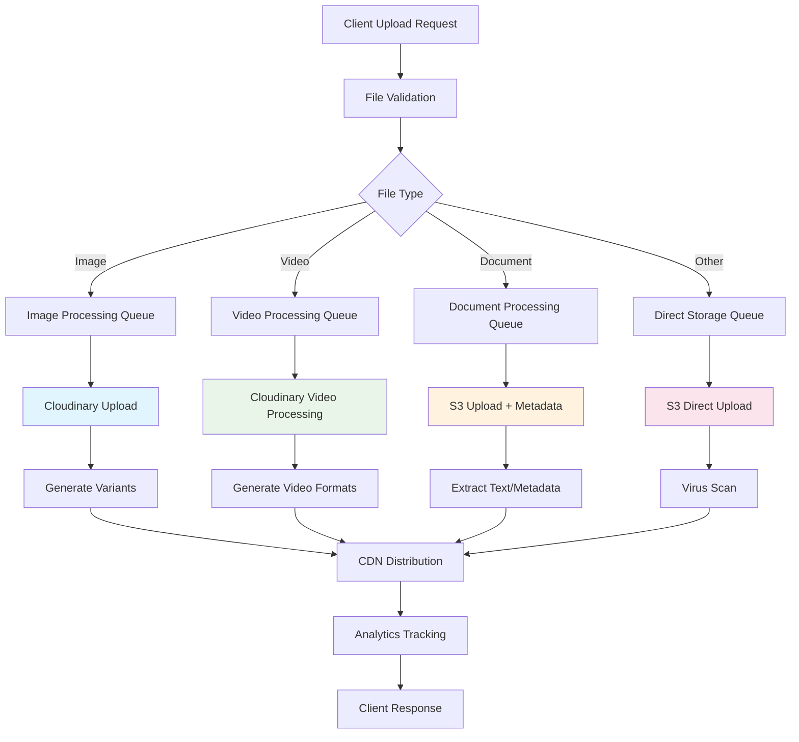

# Enterprise File Service - Cost-Effective Implementation Plan

## 📋 **Project Overview**

**Service Name**: StuntX File Service  
**Type**: Standalone Microservice  
**Architecture**: Cloud-native, Multi-provider, Enterprise-grade  
**Cost Strategy**: Free-tier maximization with CDN optimization  
**Target**: Handle all file operations (upload, storage, processing, delivery)  

---

## 💰 **COST-EFFECTIVE STRATEGY**

### **Storage Provider Comparison & Selection**
```yaml
Startup Phase (0-1K users, ~100GB storage):
  Primary: Cloudinary Free (25GB, 25K transformations) - €0
  Backup: AWS S3 Standard (€2.3/month for 100GB) - €2.3
  CDN: Cloudflare Free (unlimited bandwidth) - €0
  Processing: Cloudinary transformations - €0
  Total Cost: ~€2.3/month

Growth Phase (1K-10K users, ~1TB storage):
  Primary: Cloudinary Plus (€89/month, 1TB, 500K transforms) - €89
  Backup: AWS S3 IA (€12.5/month for 1TB) - €12.5
  CDN: Cloudflare Pro (€20/month, advanced features) - €20
  Processing: Advanced transformations included - €0
  Total Cost: ~€121.5/month

Enterprise Phase (10K+ users, 10TB+ storage):
  Primary: Cloudinary Advanced (€224/month, 2TB, 2M transforms) - €224
  Backup: AWS S3 + Glacier (€80/month for 10TB mixed) - €80
  CDN: Cloudflare Business (€200/month, enterprise) - €200
  Processing: Video processing, AI features - €0
  Total Cost: ~€504/month
```

### **Why This Stack?**
- **Cloudinary**: Best image/video processing, generous free tier
- **AWS S3**: Reliable backup, lifecycle policies
- **Cloudflare**: Global CDN, DDoS protection, free tier
- **Sharp**: Server-side processing fallback

---

## 🏗️ **ARCHITECTURE DESIGN**

### **Microservice Structure**
```
backend/services/file-service/
├── src/
│   ├── modules/
│   │   ├── upload/             # File upload handling
│   │   ├── storage/            # Multi-provider storage
│   │   ├── processing/         # Image/video processing
│   │   ├── cdn/                # CDN management
│   │   ├── metadata/           # File metadata & analytics
│   │   ├── security/           # Access control & encryption
│   │   └── optimization/       # Compression & formats
│   ├── shared/
│   │   ├── entities/           # File, Upload, Metadata entities
│   │   ├── dto/                # File operation DTOs
│   │   ├── enums/              # File types, statuses
│   │   ├── interfaces/         # Provider interfaces
│   │   └── decorators/         # File validation decorators
│   ├── providers/
│   │   ├── cloudinary/         # Cloudinary provider
│   │   ├── aws-s3/             # AWS S3 provider  
│   │   ├── local/              # Local storage provider
│   │   └── abstract/           # Base provider interface
│   └── config/                 # Service configuration
├── uploads/                    # Temporary local storage
├── templates/                  # File processing templates
├── docker/                     # Containerization
└── docs/                      # API documentation
```

### **File Processing Flow**


---

## 📦 **TECHNOLOGY STACK**

### **Core Framework**
- **NestJS 11.1.5**: Latest framework with decorators
- **TypeScript 5.8.3**: ES2023 features
- **Express 5.0.1**: Modern HTTP handling
- **TypeORM 0.3.25**: Database ORM

### **File Processing**
- **Multer**: File upload middleware
- **Sharp**: Server-side image processing
- **FFmpeg**: Video processing (via Cloudinary)
- **File-type**: MIME type detection
- **ClamAV**: Virus scanning

### **Storage Providers**
- **Cloudinary SDK**: Primary image/video storage
- **AWS SDK v3**: S3 backup storage
- **Minio**: S3-compatible local development

### **Security & Validation**
- **class-validator**: File validation
- **Helmet**: Security headers
- **Rate limiting**: Upload throttling
- **JWT**: Access token validation

---

## 🚀 **FEATURES IMPLEMENTATION**

### **Phase 1: Core Upload System (Week 1)**
```typescript
✅ Multi-format file upload (images, videos, documents)
✅ File validation (size, type, security)
✅ Cloudinary integration for images/videos
✅ S3 integration for documents/backup
✅ Basic metadata extraction
✅ Upload progress tracking
✅ Error handling & retry logic
```

### **Phase 2: Processing & Optimization (Week 2)**
```typescript
✅ Automatic image optimization (WebP, AVIF)
✅ Multiple size variants generation
✅ Video transcoding (MP4, WebM)
✅ Thumbnail generation
✅ Compression algorithms
✅ Format conversion APIs
```

### **Phase 3: CDN & Delivery (Week 3)**
```typescript
✅ Cloudflare CDN integration
✅ Intelligent caching strategies
✅ Geo-based delivery optimization
✅ Bandwidth monitoring
✅ Cache purging APIs
✅ Performance analytics
```

### **Phase 4: Advanced Features (Week 4)**
```typescript
✅ AI-powered image tagging
✅ Automatic alt-text generation
✅ Content moderation
✅ Advanced security scanning
✅ Batch operations
✅ Migration tools
```

---

## 🛡️ **SECURITY IMPLEMENTATION**

### **Upload Security**
```typescript
// File validation pipeline
const securityPipeline = {
  fileTypeValidation: true,     // MIME type checking
  virusScanning: true,          // ClamAV integration
  contentAnalysis: true,        // Malicious content detection
  sizeRestrictions: true,       // Per-user limits
  rateLimiting: true,          // Upload throttling
  encryptionAtRest: true,      // S3 encryption
  accessControl: true,         // JWT-based permissions
};
```

### **Access Control Matrix**
```yaml
Public Files:
  - Profile pictures, thumbnails
  - Marketing images, logos
  - Public document previews
  
Protected Files:
  - User documents, private media
  - Enterprise content
  - Temporary uploads
  
Admin Files:
  - System backups, logs
  - Analytics data exports
  - Configuration files
```

---

## 📊 **DATABASE SCHEMA**

### **Core Entities**
```sql
-- Files table
CREATE TABLE files (
  id VARCHAR(36) PRIMARY KEY,
  userId VARCHAR(36) NOT NULL,
  originalName VARCHAR(255) NOT NULL,
  filename VARCHAR(255) NOT NULL,
  mimeType VARCHAR(100) NOT NULL,
  size BIGINT NOT NULL,
  checksum VARCHAR(64) NOT NULL,
  
  -- Storage info
  primaryProvider ENUM('cloudinary', 's3', 'local') NOT NULL,
  primaryUrl TEXT NOT NULL,
  backupProvider ENUM('s3', 'local') NULL,
  backupUrl TEXT NULL,
  
  -- Processing info
  status ENUM('uploading', 'processing', 'ready', 'failed') DEFAULT 'uploading',
  variants JSON NULL,
  metadata JSON NULL,
  
  -- Analytics
  downloadCount INT DEFAULT 0,
  bandwidth BIGINT DEFAULT 0,
  lastAccessed TIMESTAMP NULL,
  
  -- Timestamps
  createdAt TIMESTAMP DEFAULT CURRENT_TIMESTAMP,
  updatedAt TIMESTAMP DEFAULT CURRENT_TIMESTAMP ON UPDATE CURRENT_TIMESTAMP,
  deletedAt TIMESTAMP NULL,
  
  INDEX idx_user_id (userId),
  INDEX idx_status (status),
  INDEX idx_mime_type (mimeType),
  INDEX idx_created_at (createdAt)
);

-- File variants table (thumbnails, sizes, formats)
CREATE TABLE file_variants (
  id VARCHAR(36) PRIMARY KEY,
  fileId VARCHAR(36) NOT NULL,
  variant VARCHAR(50) NOT NULL, -- 'thumbnail', 'small', 'medium', 'large', 'webp', etc.
  url TEXT NOT NULL,
  width INT NULL,
  height INT NULL,
  size BIGINT NOT NULL,
  format VARCHAR(20) NOT NULL,
  createdAt TIMESTAMP DEFAULT CURRENT_TIMESTAMP,
  
  FOREIGN KEY (fileId) REFERENCES files(id) ON DELETE CASCADE,
  UNIQUE KEY unique_file_variant (fileId, variant)
);

-- Upload sessions table (for resumable uploads)
CREATE TABLE upload_sessions (
  id VARCHAR(36) PRIMARY KEY,
  userId VARCHAR(36) NOT NULL,
  filename VARCHAR(255) NOT NULL,
  totalSize BIGINT NOT NULL,
  uploadedSize BIGINT DEFAULT 0,
  chunkSize INT DEFAULT 1048576, -- 1MB chunks
  status ENUM('active', 'completed', 'failed', 'expired') DEFAULT 'active',
  expiresAt TIMESTAMP NOT NULL,
  createdAt TIMESTAMP DEFAULT CURRENT_TIMESTAMP,
  
  INDEX idx_user_id (userId),
  INDEX idx_status (status),
  INDEX idx_expires_at (expiresAt)
);
```

---

## 🔧 **API ENDPOINTS DESIGN**

### **Upload Operations**
```typescript
// Single file upload
POST /api/files/upload
Content-Type: multipart/form-data
{
  file: File,
  category?: 'profile' | 'document' | 'media' | 'attachment',
  privacy?: 'public' | 'private' | 'protected',
  variants?: string[], // ['thumbnail', 'small', 'medium']
}

// Resumable upload (large files)
POST /api/files/upload/resumable/init
{
  filename: string,
  size: number,
  mimeType: string,
  chunkSize?: number
}

PATCH /api/files/upload/resumable/{sessionId}/chunk/{chunkIndex}
Content-Type: application/octet-stream
```

### **File Management**
```typescript
// Get file info
GET /api/files/{fileId}
GET /api/files/{fileId}/metadata

// Update file
PATCH /api/files/{fileId}
{
  filename?: string,
  privacy?: 'public' | 'private' | 'protected',
  metadata?: Record<string, any>
}

// Delete file
DELETE /api/files/{fileId}
```

### **Processing Operations**
```typescript
// Generate variants
POST /api/files/{fileId}/variants
{
  variants: [
    { name: 'thumbnail', width: 150, height: 150 },
    { name: 'small', width: 300, quality: 80 },
    { name: 'webp', format: 'webp', quality: 90 }
  ]
}

// Optimize existing file
POST /api/files/{fileId}/optimize
{
  quality?: number,
  format?: 'jpeg' | 'png' | 'webp' | 'avif',
  progressive?: boolean
}
```

---

## 🚀 **DEVELOPMENT PLAN**

### **Week 1: Foundation & Core Upload**
- [ ] Project setup with NestJS 11.1.5
- [ ] Database schema implementation
- [ ] Basic file upload with Multer
- [ ] Cloudinary integration
- [ ] AWS S3 integration
- [ ] File validation pipeline
- [ ] Basic error handling

### **Week 2: Processing & Variants**
- [ ] Sharp integration for image processing
- [ ] Automatic variant generation
- [ ] Video processing via Cloudinary
- [ ] Metadata extraction
- [ ] Background job processing
- [ ] Progress tracking system

### **Week 3: CDN & Optimization**
- [ ] Cloudflare CDN integration
- [ ] Intelligent caching
- [ ] Performance monitoring
- [ ] Bandwidth tracking
- [ ] Cache management APIs
- [ ] Load testing

### **Week 4: Advanced Features**
- [ ] Resumable uploads
- [ ] Batch operations
- [ ] Content moderation
- [ ] Analytics dashboard
- [ ] Admin tools
- [ ] Documentation

---

## 💰 **COST OPTIMIZATION STRATEGIES**

### **Storage Lifecycle Management**
```typescript
const lifecyclePolicies = {
  // Move old files to cheaper storage
  coldStorage: {
    after: '90 days',
    destination: 'S3 Glacier',
    costSaving: '70%'
  },
  
  // Delete temporary files
  tempCleanup: {
    after: '24 hours',
    fileTypes: ['upload-temp', 'preview'],
    costSaving: '100%'
  },
  
  // Compress old images
  automaticCompression: {
    after: '30 days',
    method: 'WebP conversion',
    costSaving: '40%'
  }
};
```

### **Smart CDN Usage**
```typescript
const cdnOptimization = {
  // Cache popular files longer
  popularContent: {
    cacheTime: '30 days',
    preload: true
  },
  
  // Geo-based delivery
  geoRouting: {
    enabled: true,
    regions: ['us-east', 'eu-west', 'asia-pacific']
  },
  
  // Bandwidth monitoring
  bandwidthAlerts: {
    threshold: '80% of monthly limit',
    autoOptimize: true
  }
};
```

---

## 🔍 **MONITORING & ANALYTICS**

### **Key Metrics to Track**
```typescript
const fileServiceMetrics = {
  performance: {
    uploadSpeed: 'Average MB/s per upload',
    processingTime: 'Time to generate variants',
    deliveryLatency: 'CDN response times',
    errorRate: 'Failed uploads/processing %'
  },
  
  usage: {
    storageUsed: 'Total GB across all providers',
    bandwidth: 'Monthly CDN bandwidth usage',
    transformations: 'Cloudinary API calls',
    activeFiles: 'Files accessed in last 30 days'
  },
  
  costs: {
    cloudinaryUsage: 'Transformations used vs limit',
    s3Costs: 'Storage + transfer costs',
    cdnBandwidth: 'Cloudflare usage tracking',
    projectedMonthly: 'Cost forecast based on usage'
  }
};
```

---

## 🛡️ **SECURITY CHECKLIST**

- [ ] **File Type Validation**: Strict MIME type checking
- [ ] **Virus Scanning**: ClamAV integration for uploads
- [ ] **Size Limits**: Per-user and per-file restrictions
- [ ] **Rate Limiting**: Upload throttling to prevent abuse
- [ ] **Access Control**: JWT-based file access permissions
- [ ] **Encryption**: At-rest encryption for sensitive files
- [ ] **Content Moderation**: AI-powered inappropriate content detection
- [ ] **Audit Logging**: Track all file operations
- [ ] **CORS Configuration**: Secure cross-origin requests
- [ ] **HTTPS Only**: Force secure connections

---

## 📝 **CONFIGURATION MANAGEMENT**

### **Environment Variables**
```bash
# Cloudinary Configuration
CLOUDINARY_CLOUD_NAME=your-cloud-name
CLOUDINARY_API_KEY=your-api-key
CLOUDINARY_API_SECRET=your-api-secret

# AWS S3 Configuration
AWS_ACCESS_KEY_ID=your-access-key
AWS_SECRET_ACCESS_KEY=your-secret-key
AWS_REGION=us-east-1
AWS_S3_BUCKET=stunxt-files-backup

# Cloudflare Configuration
CLOUDFLARE_API_TOKEN=your-api-token
CLOUDFLARE_ZONE_ID=your-zone-id

# Security
JWT_SECRET=your-jwt-secret
ENCRYPTION_KEY=your-encryption-key
VIRUS_SCAN_ENABLED=true

# Limits
MAX_FILE_SIZE=100MB
MAX_DAILY_UPLOADS=1000
ALLOWED_MIME_TYPES=image/*,video/*,application/pdf
```

---

## 🎯 **SUCCESS CRITERIA**

### **Performance Targets**
- ✅ Upload speed: >10 MB/s for images
- ✅ Processing time: <30s for image variants
- ✅ CDN latency: <200ms globally
- ✅ Uptime: 99.9% availability

### **Cost Targets**
- ✅ Startup: <€10/month for 1K users
- ✅ Growth: <€150/month for 10K users
- ✅ Enterprise: <€500/month for 50K+ users

### **Security Targets**
- ✅ 0% malicious file uploads
- ✅ 100% virus scan coverage
- ✅ <1% false positive rate
- ✅ SOC2 compliance ready

---

## 🚀 **READY TO START?**

This plan provides a comprehensive roadmap for implementing an enterprise-grade file service that:

1. **Maximizes free tiers** to minimize startup costs
2. **Scales efficiently** with your user growth
3. **Maintains security** without compromising performance
4. **Integrates seamlessly** with your existing NestJS ecosystem

**Next Steps:**
1. ✅ Review and approve this implementation plan
2. 🚀 Start with Week 1 foundation setup
3. 📦 Integrate with existing authentication system
4. 🔄 Implement with notification service for file upload notifications

Ready to proceed with the implementation? 🎯
