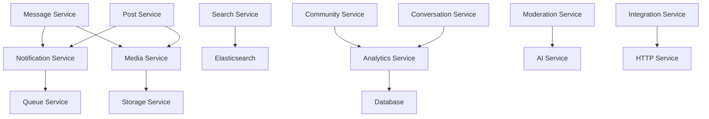

# Missing Services Implementation Guide

## 📋 Overview

This document outlines the missing services in the StuntX V2 enterprise messaging platform and provides implementation roadmaps for each service. The current messaging system has placeholders and references to services that need to be built to achieve full enterprise functionality.

## 🎯 Current System Status

### ✅ **Completed Services**
- **Authentication Service**: Complete with JWT, rate limiting, enterprise security
- **User Management Service**: User profiles, roles, permissions
- **Messaging Service**: Real-time messaging with optimistic updates, WebSocket support
- **Conversation Service**: Group/private chat management, participant handling
- **Post Service**: Community posts with categorization and statistics
- **Community Service**: Community management with spaces and roles
- **Space Service**: Team workspace management

### 🚨 **Missing Critical Services**

---

## 1. 🔔 **Notification Service** (HIGH PRIORITY)

### **Current Status**: Missing entirely
### **Dependencies**: Messaging, Posts, Communities are waiting for this

### **Required Implementation**

```typescript
// src/modules/notifications/notification.service.ts
@Injectable()
export class NotificationService {
  constructor(
    @InjectRepository(Notification)
    private notificationRepository: Repository<Notification>,
    @InjectRepository(NotificationPreference)
    private preferenceRepository: Repository<NotificationPreference>,
    private configService: ConfigService,
    private queueService: QueueService, // Will need this too
  ) {}

  // Push notifications (FCM, APNs)
  async sendPushNotification(
    userId: string, 
    payload: PushNotificationDto
  ): Promise<void> {
    // Implementation for Firebase Cloud Messaging
    // Integration with Apple Push Notification service
  }
  
  // Email notifications (SendGrid/SES)
  async sendEmailNotification(
    userId: string, 
    template: string, 
    data: any
  ): Promise<void> {
    // Email template processing
    // Queue email for delivery
  }
  
  // In-app notifications
  async createInAppNotification(
    userId: string, 
    notification: CreateNotificationDto
  ): Promise<Notification> {
    // Create database notification
    // Send real-time WebSocket notification
  }
  
  // Notification preferences
  async updateNotificationPreferences(
    userId: string, 
    preferences: NotificationPreferencesDto
  ): Promise<void> {
    // Update user's notification settings
    // Validate preference types
  }
  
  // Bulk notifications
  async sendBulkNotifications(
    userIds: string[], 
    notification: BulkNotificationDto
  ): Promise<void> {
    // Efficient bulk notification processing
    // Rate limiting and batch processing
  }

  // Message notifications (currently missing in MessageService)
  async notifyNewMessage(
    conversationId: string,
    senderId: string,
    messageContent: string
  ): Promise<void> {
    // Get conversation participants
    // Check notification preferences
    // Send appropriate notifications (push/email/in-app)
  }

  // Community notifications
  async notifyNewPost(
    postId: string,
    authorId: string,
    communityId: string
  ): Promise<void> {
    // Notify community members of new posts
    // Respect user notification preferences
  }
}
```

### **Required Entities**

```typescript
// src/shared/entities/notification.entity.ts
@Entity('notifications')
export class Notification {
  @PrimaryGeneratedColumn('uuid')
  id: string;

  @Column({ type: 'uuid' })
  userId: string;

  @Column()
  title: string;

  @Column('text')
  content: string;

  @Column({
    type: 'enum',
    enum: ['message', 'post', 'comment', 'reaction', 'system', 'community'],
  })
  type: NotificationType;

  @Column({ type: 'uuid', nullable: true })
  relatedEntityId: string; // Message ID, Post ID, etc.

  @Column({ default: false })
  isRead: boolean;

  @Column({ type: 'timestamp', default: () => 'CURRENT_TIMESTAMP' })
  createdAt: Date;

  @Column({ type: 'timestamp', nullable: true })
  readAt: Date;

  @Column('jsonb', { nullable: true })
  metadata: any; // Additional notification data
}

// src/shared/entities/notification-preference.entity.ts
@Entity('notification_preferences')
export class NotificationPreference {
  @PrimaryGeneratedColumn('uuid')
  id: string;

  @Column({ type: 'uuid' })
  userId: string;

  @Column({
    type: 'enum',
    enum: ['message', 'post', 'comment', 'reaction', 'system', 'community'],
  })
  notificationType: NotificationType;

  @Column({ default: true })
  inAppEnabled: boolean;

  @Column({ default: true })
  pushEnabled: boolean;

  @Column({ default: false })
  emailEnabled: boolean;

  @Column({ default: false })
  smsEnabled: boolean;
}
```

### **Integration Points**

1. **MessageService.sendMessage()** - Currently has placeholder notification call
2. **PostService.createPost()** - Needs community notification integration
3. **ConversationService.addParticipant()** - Should notify about new members

---

## 2. 📁 **File/Media Service** (HIGH PRIORITY)

### **Current Status**: Missing entirely
### **Dependencies**: Messages have attachment fields, Posts reference media uploads

### **Required Implementation**

```typescript
// src/modules/media/media.service.ts
@Injectable()
export class MediaService {
  constructor(
    @InjectRepository(MediaFile)
    private mediaRepository: Repository<MediaFile>,
    private configService: ConfigService,
    private storageService: StorageService, // AWS S3, Google Cloud, etc.
  ) {}

  // File upload with validation
  async uploadFile(
    file: Express.Multer.File, 
    userId: string,
    options?: UploadOptions
  ): Promise<MediaFile> {
    // Validate file type and size
    // Generate unique filename
    // Upload to cloud storage
    // Create database record
    // Generate thumbnails for images
  }
  
  // Image processing and optimization
  async processImage(
    file: Express.Multer.File, 
    options: ImageProcessingOptions
  ): Promise<ProcessedImage> {
    // Resize images
    // Generate thumbnails
    // Optimize for web delivery
    // Create multiple resolutions
  }
  
  // File management
  async deleteFile(fileId: string, userId: string): Promise<void> {
    // Verify ownership
    // Remove from storage
    // Clean up database
    // Remove thumbnails
  }

  async getFileMetadata(fileId: string): Promise<FileMetadata> {
    // Return file information
    // Check access permissions
  }
  
  // CDN integration for fast delivery
  async generateSignedUrl(
    fileId: string, 
    expiresIn: number = 3600
  ): Promise<string> {
    // Generate temporary access URLs
    // Handle private file access
  }
  
  // Storage optimization
  async compressFile(file: Express.Multer.File): Promise<Buffer> {
    // Compress images and videos
    // Reduce file sizes for storage efficiency
  }

  // Bulk operations
  async uploadMultipleFiles(
    files: Express.Multer.File[],
    userId: string
  ): Promise<MediaFile[]> {
    // Handle multiple file uploads efficiently
    // Batch processing
  }
}
```

### **Required Entities**

```typescript
// src/shared/entities/media-file.entity.ts
@Entity('media_files')
export class MediaFile {
  @PrimaryGeneratedColumn('uuid')
  id: string;

  @Column()
  originalName: string;

  @Column()
  filename: string;

  @Column()
  mimeType: string;

  @Column({ type: 'bigint' })
  size: number;

  @Column()
  storageKey: string; // S3 key, Google Cloud path, etc.

  @Column()
  cdnUrl: string;

  @Column({ type: 'uuid' })
  uploadedBy: string;

  @Column({
    type: 'enum',
    enum: ['image', 'video', 'audio', 'document', 'other'],
  })
  type: MediaType;

  @Column('jsonb', { nullable: true })
  metadata: {
    width?: number;
    height?: number;
    duration?: number;
    thumbnails?: string[];
    processedVersions?: Record<string, string>;
  };

  @Column({ type: 'timestamp', default: () => 'CURRENT_TIMESTAMP' })
  createdAt: Date;

  @Column({ default: false })
  isDeleted: boolean;
}
```

### **Integration Points**

1. **Message.attachments** - Currently just a JSON field, needs proper file handling
2. **Post media uploads** - Posts need image/video attachment support
3. **User avatars** - Profile picture management
4. **Community banners** - Community customization

---

## 3. 🔍 **Search Service** (MEDIUM PRIORITY)

### **Current Status**: Partially implemented (basic search exists but incomplete)
### **Dependencies**: All content services need comprehensive search

### **Required Implementation**

```typescript
// src/modules/search/search.service.ts
@Injectable()
export class SearchService {
  constructor(
    private elasticsearchService: ElasticsearchService, // or similar
    private messageService: MessageService,
    private postService: PostService,
    private communityService: CommunityService,
    private userService: UserService,
  ) {}

  // Global search across all content types
  async globalSearch(
    query: string, 
    userId: string, 
    filters?: SearchFilters
  ): Promise<SearchResults> {
    // Search across messages, posts, communities, users
    // Apply permission-based filtering
    // Rank results by relevance and recency
  }
  
  // Enhanced message search (currently placeholder in ConversationController)
  async searchMessages(
    conversationId: string, 
    query: string, 
    options?: MessageSearchOptions
  ): Promise<Message[]> {
    // Full-text search in conversation messages
    // Search by date range, sender, content type
    // Highlight matching text
  }
  
  // Enhanced community search
  async searchCommunities(
    query: string, 
    filters?: CommunitySearchFilters
  ): Promise<Community[]> {
    // Search community names, descriptions
    // Filter by category, member count, activity
    // Include space search within communities
  }
  
  // User search with privacy controls
  async searchUsers(
    query: string, 
    requesterId: string,
    filters?: UserSearchFilters
  ): Promise<User[]> {
    // Search usernames, display names
    // Respect privacy settings
    // Filter by online status, mutual connections
  }
  
  // Content indexing for search optimization
  async indexContent(content: IndexableContent): Promise<void> {
    // Add content to search index
    // Extract searchable text from various content types
  }

  async removeFromIndex(
    contentId: string, 
    contentType: string
  ): Promise<void> {
    // Remove deleted content from search index
  }

  // Auto-suggestions and typeahead
  async getSuggestions(
    query: string, 
    type: 'users' | 'communities' | 'content'
  ): Promise<string[]> {
    // Provide search suggestions as user types
  }
}
```

### **Integration Points**

1. **ConversationController.searchConversation()** - Currently returns "coming soon"
2. **Community search enhancement** - Improve existing basic search
3. **Global search endpoint** - New feature for platform-wide search

---

## 4. 📊 **Analytics Service** (MEDIUM PRIORITY)

### **Current Status**: Missing (placeholder in ConversationController)
### **Dependencies**: All services need analytics tracking

### **Required Implementation**

```typescript
// src/modules/analytics/analytics.service.ts
@Injectable()
export class AnalyticsService {
  constructor(
    @InjectRepository(AnalyticsEvent)
    private analyticsRepository: Repository<AnalyticsEvent>,
    @InjectRepository(UserEngagement)
    private engagementRepository: Repository<UserEngagement>,
    private cacheService: CacheService,
  ) {}

  // Conversation analytics (for ConversationController.getConversationAnalytics)
  async getConversationAnalytics(
    conversationId: string, 
    timeframe: string
  ): Promise<ConversationAnalytics> {
    // Message volume over time
    // Participant engagement rates
    // Response time analytics
    // Peak activity periods
  }
  
  // Community analytics
  async getCommunityAnalytics(
    communityId: string, 
    timeframe: string
  ): Promise<CommunityAnalytics> {
    // Post engagement metrics
    // Member growth and retention
    // Content performance
    // Space activity breakdown
  }
  
  // User engagement tracking
  async getUserEngagementStats(userId: string): Promise<UserEngagement> {
    // Messages sent/received
    // Posts created/engagement received
    // Communities joined/participation
    // Session duration and frequency
  }
  
  // Platform-wide metrics
  async getPlatformMetrics(dateRange: DateRange): Promise<PlatformMetrics> {
    // Total active users
    // Message volume
    // Community growth
    // Feature usage statistics
  }
  
  // Real-time event tracking
  async trackEvent(event: AnalyticsEvent): Promise<void> {
    // Track user actions for analytics
    // Store in time-series format
    // Enable real-time dashboards
  }

  // Report generation
  async generateReport(
    reportType: string, 
    parameters: ReportParameters
  ): Promise<Report> {
    // Generate detailed analytics reports
    // Export data for external analysis
  }
}
```

### **Integration Points**

1. **ConversationController.getConversationAnalytics()** - Currently returns mock data
2. **All services** - Need event tracking integration
3. **Admin dashboard** - Requires comprehensive platform metrics

---

## 5. 🛡️ **Content Moderation Service** (MEDIUM PRIORITY)

### **Current Status**: Missing (referenced in messaging README)
### **Dependencies**: All user-generated content needs moderation

### **Required Implementation**

```typescript
// src/modules/moderation/moderation.service.ts
@Injectable()
export class ModerationService {
  constructor(
    @InjectRepository(ModerationAction)
    private moderationRepository: Repository<ModerationAction>,
    @InjectRepository(ContentReport)
    private reportRepository: Repository<ContentReport>,
    private aiModerationService: AIModerationService, // External AI service
  ) {}

  // Automatic content filtering
  async moderateContent(
    content: string, 
    type: ContentType
  ): Promise<ModerationResult> {
    // Check for inappropriate content
    // Profanity filtering
    // Spam detection
    // Hate speech detection
  }
  
  // Message moderation integration
  async autoModerateMessage(messageId: string): Promise<ModerationAction> {
    // Automatically review message content
    // Take action if violations found
    // Queue for human review if uncertain
  }
  
  // User reporting system
  async flagContentForReview(
    contentId: string, 
    reason: string, 
    reportedBy: string
  ): Promise<void> {
    // Allow users to report inappropriate content
    // Create moderation queue entry
  }

  async reviewFlaggedContent(
    contentId: string, 
    moderatorId: string, 
    action: ModerationAction
  ): Promise<void> {
    // Human moderator review interface
    // Apply moderation decisions
  }
  
  // User management actions
  async banUser(
    userId: string, 
    reason: string, 
    duration?: number
  ): Promise<void> {
    // Temporary or permanent user bans
    // Restrict access to platform features
  }

  async muteUser(
    userId: string, 
    communityId: string, 
    duration: number
  ): Promise<void> {
    // Community-specific muting
    // Prevent posting in specific communities
  }
  
  // Dynamic moderation rules
  async createModerationRule(rule: ModerationRule): Promise<ModerationRule> {
    // Create custom moderation rules
    // Community-specific moderation settings
  }

  async applyModerationRules(content: string): Promise<ModerationResult> {
    // Apply all active moderation rules
    // Return actions to be taken
  }
}
```

### **Integration Points**

1. **MessageService** - All messages need moderation checking
2. **PostService** - Posts and comments need content filtering
3. **CommunityService** - Community-specific moderation rules

---

## 6. 🔗 **Integration Service** (LOW PRIORITY)

### **Current Status**: Missing
### **Dependencies**: Enhanced user experience features

### **Required Implementation**

```typescript
// src/modules/integrations/integration.service.ts
@Injectable()
export class IntegrationService {
  constructor(
    @InjectRepository(Integration)
    private integrationRepository: Repository<Integration>,
    @InjectRepository(Webhook)
    private webhookRepository: Repository<Webhook>,
    private httpService: HttpService,
  ) {}

  // URL preview generation
  async generateUrlPreview(url: string): Promise<UrlPreview> {
    // Fetch webpage metadata
    // Extract title, description, images
    // Generate rich preview cards
  }
  
  // External platform integrations
  async integrateWithDiscord(
    guildId: string, 
    settings: DiscordIntegration
  ): Promise<void> {
    // Two-way Discord integration
    // Sync messages between platforms
  }

  async integrateWithSlack(
    workspaceId: string, 
    settings: SlackIntegration
  ): Promise<void> {
    // Slack workspace integration
    // Channel synchronization
  }
  
  // Webhook system
  async createWebhook(
    url: string, 
    events: string[]
  ): Promise<Webhook> {
    // Allow external systems to receive events
    // Message sent, user joined, etc.
  }

  async triggerWebhook(
    webhookId: string, 
    payload: any
  ): Promise<void> {
    // Send webhook notifications
    // Retry failed deliveries
  }
  
  // OAuth provider connections
  async connectOAuthProvider(
    userId: string, 
    provider: string, 
    token: string
  ): Promise<void> {
    // Connect Google, GitHub, LinkedIn accounts
    // Import contacts and connections
  }
}
```

---

## 🔧 **Missing Infrastructure Components**

### 1. **Queue Management Service**

```typescript
// src/modules/queue/queue.service.ts
@Injectable()
export class QueueService {
  constructor(
    @InjectQueue('email') private emailQueue: Queue,
    @InjectQueue('notifications') private notificationQueue: Queue,
    @InjectQueue('file-processing') private fileQueue: Queue,
  ) {}

  // Background job management
  async addJob(
    queueName: string, 
    jobData: any, 
    options?: JobOptions
  ): Promise<Job> {
    // Add jobs to appropriate queues
    // Handle job priorities and delays
  }
  
  // Email queue (for NotificationService)
  async queueEmail(emailData: EmailJob): Promise<void> {
    // Queue email delivery
    // Handle email templates and personalization
  }
  
  // Notification queue
  async queueNotification(
    notificationData: NotificationJob
  ): Promise<void> {
    // Queue push notifications
    // Batch similar notifications
  }
  
  // File processing queue (for MediaService)
  async queueFileProcessing(
    fileData: FileProcessingJob
  ): Promise<void> {
    // Queue image/video processing
    // Generate thumbnails and optimized versions
  }
}
```

### 2. **Enhanced Caching Service**

```typescript
// src/modules/cache/cache.service.ts
@Injectable()
export class CacheService {
  constructor(
    @Inject(CACHE_MANAGER) private cacheManager: Cache,
    private redisService: RedisService,
  ) {}

  // Advanced caching patterns
  async getOrSet<T>(
    key: string, 
    factory: () => Promise<T>, 
    ttl?: number
  ): Promise<T> {
    // Get from cache or execute factory function
    // Set cache with result
  }
  
  // Cache invalidation patterns
  async invalidatePattern(pattern: string): Promise<void> {
    // Invalidate multiple cache keys by pattern
    // Clear related cache entries
  }

  async invalidateUserCache(userId: string): Promise<void> {
    // Invalidate all cache entries for a user
    // Clear conversations, notifications, etc.
  }
  
  // Distributed caching for scaling
  async distributedLock(key: string, ttl: number): Promise<boolean> {
    // Prevent race conditions in distributed environment
    // Lock critical operations
  }

  async releaseLock(key: string): Promise<void> {
    // Release distributed locks
  }
}
```

---

## 🎯 **Implementation Roadmap**

### **Phase 1: Critical Services (Weeks 1-4)**
1. **Week 1-2**: **Notification Service**
   - Create notification entities and DTOs
   - Implement push notification infrastructure
   - Integrate with existing MessageService
   - Add email notification support

2. **Week 3-4**: **File/Media Service**
   - Set up cloud storage integration (AWS S3/Google Cloud)
   - Create file upload endpoints
   - Implement image processing pipeline
   - Add file management features

### **Phase 2: Core Features (Weeks 5-8)**
3. **Week 5-6**: **Search Service Enhancement**
   - Implement full-text search with Elasticsearch
   - Enhance existing search endpoints
   - Add global search functionality
   - Create search suggestion system

4. **Week 7-8**: **Analytics Service**
   - Create analytics data models
   - Implement conversation analytics
   - Add user engagement tracking
   - Build basic reporting features

### **Phase 3: Advanced Features (Weeks 9-12)**
5. **Week 9-10**: **Content Moderation Service**
   - Implement automatic content filtering
   - Create moderation dashboard
   - Add user reporting system
   - Integrate AI moderation tools

6. **Week 11-12**: **Integration Service & Infrastructure**
   - Build URL preview system
   - Create webhook infrastructure
   - Implement queue management
   - Enhance caching system

---

## 🚨 **Immediate Action Items**

### **High Priority Fixes Needed Now:**

1. **MessageService.trackMessageDelivery()** - Currently has placeholder notification call
2. **ConversationController.searchConversation()** - Returns "coming soon" 
3. **ConversationController.getConversationAnalytics()** - Returns mock data
4. **Message.attachments** - Field exists but no upload handling
5. **Post media uploads** - Referenced but not implemented

### **Quick Wins (Can implement this week):**

1. **Basic Notification Service** - Start with in-app notifications only
2. **Simple File Upload** - Basic file handling for messages
3. **Enhanced Message Search** - Improve the existing search placeholder
4. **Basic Analytics** - Real conversation statistics instead of mock data

---

## 📋 **Service Dependencies**



## 🧪 **Testing Strategy**

### **Unit Testing Requirements:**
- Each service should have 80%+ test coverage
- Mock external dependencies (storage, email, etc.)
- Test error handling and edge cases

### **Integration Testing:**
- Test service interactions
- End-to-end workflow testing
- Performance testing under load

### **API Testing:**
- Swagger documentation for all endpoints
- Postman collections for manual testing
- Automated API test suites

---

## 📚 **Documentation Requirements**

Each new service needs:
1. **API Documentation** - Swagger/OpenAPI specs
2. **Service Documentation** - Implementation details
3. **Integration Guide** - How to use with existing services
4. **Configuration Guide** - Environment variables and setup
5. **Troubleshooting Guide** - Common issues and solutions

---

## 🎯 **Success Metrics**

### **Technical Metrics:**
- Response time < 100ms for cached requests
- 99.9% uptime for core services
- < 5% error rate across all endpoints

### **Business Metrics:**
- User engagement increase by 25%
- Message delivery success rate > 99%
- Search result relevance score > 80%

---

## 💡 **Recommended Next Steps**

1. **Start with Notification Service** - It's the most critical missing piece
2. **Set up development environment** for new services
3. **Create service templates** for consistent structure
4. **Implement CI/CD pipelines** for new services
5. **Create monitoring and alerting** for service health

This implementation guide provides a complete roadmap for building out the missing enterprise features in your StuntX V2 platform. Start with the Notification Service as it's currently blocking the full functionality of your messaging system!


Current System Issues


MessageService.trackMessageDelivery() - Placeholder notification call
ConversationController.searchConversation() - Returns "coming soon"
ConversationController.getConversationAnalytics() - Mock data
Message.attachments - Field exists but no file handling


💡 Immediate Recommendations


Start with Notification Service - Most critical for messaging
Quick file upload implementation - Basic media handling
Real analytics instead of mock data - Easy improvement
Enhanced search functionality - Improve existing placeholders