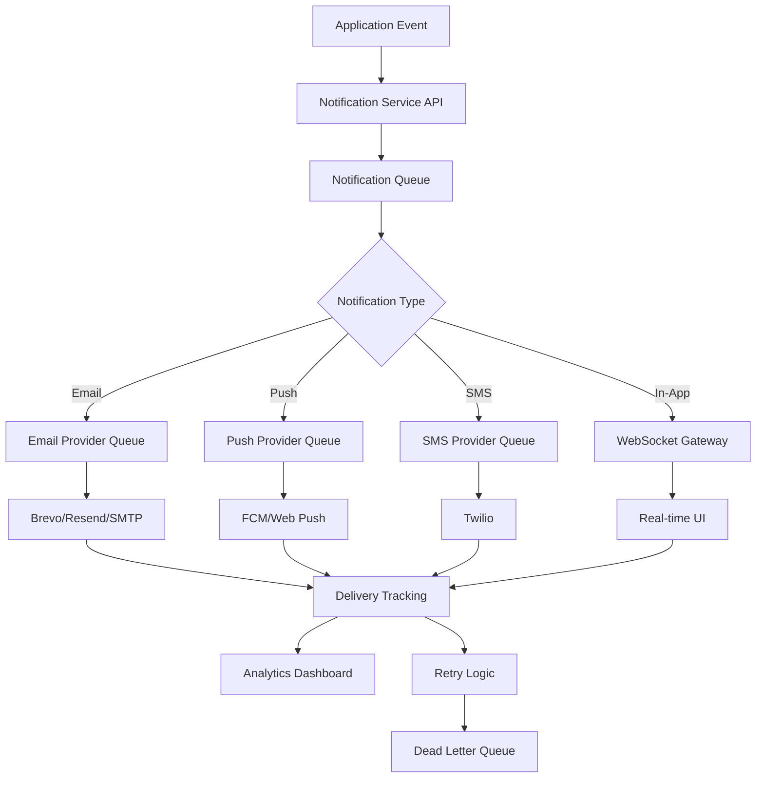

# Enterprise Notification Service - Cost-Effective Implementation Plan

## 📋 **Project Overview**

**Service Name**: StuntX Notification Service  
**Type**: Standalone Microservice  
**Architecture**: Event-driven, Multi-provider, Enterprise-grade  
**Cost Strategy**: Free-tier maximization with professional scalability  
**Target**: Handle entire application notification needs  

---

## 💰 **COST-EFFECTIVE STRATEGY**

### **Current Infrastructure Leverage**
- ✅ **Existing Email Setup**: Nodemailer with SMTP (keep as fallback)
- ✅ **Existing Database**: PostgreSQL (extend for notifications)
- ✅ **Existing Cache**: Redis (use for queues and rate limiting)
- ✅ **Existing Framework**: NestJS ecosystem compatibility

### **Free Tier Maximization Plan**
```yaml
Startup Phase (0-1K users):
  Email: Brevo Free (9K emails/month) - €0
  Push: Firebase FCM (unlimited) - €0  
  Web Push: Native Browser API - €0
  SMS: Twilio (security only ~€15/month)
  Total Cost: ~€15/month

Growth Phase (1K-10K users):
  Email: Brevo Pro (20K emails/month) - €25
  Push: Firebase FCM (unlimited) - €0
  Web Push: Native Browser API - €0
  SMS: Twilio (increased security) - €50
  Total Cost: ~€75/month

Enterprise Phase (10K+ users):
  Email: Brevo Premium (100K emails/month) - €65
  Push: Firebase FCM (unlimited) - €0
  Web Push: Native Browser API - €0
  SMS: Twilio (full security suite) - €150
  Total Cost: ~€215/month
```

---

## 🏗️ **ARCHITECTURE DESIGN**

### **Microservice Structure**
```
backend/services/notification-service/
├── src/
│   ├── modules/
│   │   ├── providers/          # Email, Push, SMS providers
│   │   ├── templates/          # Notification templates
│   │   ├── queue/             # Background job processing
│   │   ├── preferences/       # User notification preferences
│   │   ├── analytics/         # Delivery tracking & analytics
│   │   └── webhooks/          # Delivery webhooks
│   ├── shared/
│   │   ├── entities/          # Database entities
│   │   ├── dto/               # Data transfer objects
│   │   ├── enums/             # Notification types & statuses
│   │   └── interfaces/        # Type definitions
│   └── config/                # Service configuration
├── templates/                 # Email/Push templates
├── docker/                    # Containerization
└── docs/                     # API documentation
```

### **Event-Driven Flow**


---

## 📦 **TECHNOLOGY STACK**

### **Core Framework**
```json
{
  "framework": "NestJS v10",
  "language": "TypeScript",
  "database": "PostgreSQL (existing)",
  "cache": "Redis (existing)",
  "queue": "Bull Queue (Redis-based)",
  "validation": "Class-validator + Joi"
}
```

### **Provider Dependencies**
```json
{
  "dependencies": {
    // CORE FRAMEWORK
    "@nestjs/common": "^10.0.0",
    "@nestjs/typeorm": "^10.0.0",
    "@nestjs/bull": "^10.0.1",
    "@nestjs/cache-manager": "^2.1.0",
    "@nestjs/throttler": "^5.0.0",
    
    // QUEUE SYSTEM
    "bull": "^4.11.4",
    "ioredis": "^5.3.2",
    
    // EMAIL PROVIDERS
    "@getbrevo/brevo": "^1.0.1",           // Primary: Brevo
    "resend": "^1.1.0",                    // Secondary: Resend
    "nodemailer": "^6.9.4",               // Fallback: Existing SMTP
    
    // PUSH NOTIFICATIONS
    "firebase-admin": "^11.10.1",          // Mobile: FCM (FREE)
    "web-push": "^3.6.3",                 // Web: Native Push (FREE)
    
    // SMS PROVIDER  
    "twilio": "^4.15.0",                   // Security alerts only
    
    // TEMPLATE ENGINE
    "handlebars": "^4.7.8",               // Email templates
    "@mjml/mjml": "^4.14.1",              // Responsive email design
    
    // UTILITIES
    "joi": "^17.9.2",                     // Configuration validation
    "class-validator": "^0.14.0",         // DTO validation
    "uuid": "^9.0.0",                     // Unique identifiers
    "dayjs": "^1.11.9",                   // Date manipulation
    "lodash": "^4.17.21",                 // Utility functions
    
    // MONITORING
    "@sentry/node": "^7.64.0",            // Error tracking
    "prom-client": "^14.2.0"              // Metrics collection
  }
}
```

---

## 🎯 **NOTIFICATION TYPES & CHANNELS**

### **Notification Categories**
```typescript
export enum NotificationType {
  // MESSAGING
  NEW_MESSAGE = 'new_message',
  MESSAGE_REACTION = 'message_reaction', 
  CONVERSATION_INVITE = 'conversation_invite',
  MENTION = 'mention',
  
  // COMMUNITY & SOCIAL
  COMMUNITY_INVITE = 'community_invite',
  COMMUNITY_POST = 'community_post',
  POST_REACTION = 'post_reaction',
  POST_COMMENT = 'post_comment',
  COMMUNITY_EVENT = 'community_event',
  FOLLOW_REQUEST = 'follow_request',
  
  // SYSTEM & SECURITY
  SECURITY_ALERT = 'security_alert',
  LOGIN_ATTEMPT = 'login_attempt',
  PASSWORD_CHANGED = 'password_changed',
  TWO_FA_CODE = 'two_fa_code',
  ACCOUNT_LOCKED = 'account_locked',
  
  // PLATFORM
  SYSTEM_MAINTENANCE = 'system_maintenance',
  FEATURE_ANNOUNCEMENT = 'feature_announcement',
  ACCOUNT_UPDATE = 'account_update',
  
  // MARKETING (LIMITED)
  NEWSLETTER = 'newsletter',
  FEATURE_SPOTLIGHT = 'feature_spotlight'
}

export enum DeliveryChannel {
  IN_APP = 'in_app',           // Real-time WebSocket
  PUSH = 'push',               // Mobile/Web push
  EMAIL = 'email',             // Email notifications
  SMS = 'sms',                 // Security alerts only
  WEBHOOK = 'webhook'          // Third-party integrations
}

export enum NotificationPriority {
  IMMEDIATE = 'immediate',     // Security alerts (all channels)
  HIGH = 'high',              // Messages, mentions (push + in-app)
  NORMAL = 'normal',          // Posts, reactions (in-app + email digest)
  LOW = 'low'                 // Marketing (email only)
}
```

### **Channel Strategy by Type**
```yaml
Security Alerts:
  Channels: [SMS, PUSH, EMAIL, IN_APP]
  Priority: IMMEDIATE
  Cost: High (SMS) but essential

Messages & Social:
  Channels: [PUSH, IN_APP, EMAIL_DIGEST]
  Priority: HIGH
  Cost: Low (mostly free channels)

System Updates:
  Channels: [IN_APP, EMAIL]
  Priority: NORMAL
  Cost: Low

Marketing:
  Channels: [EMAIL]
  Priority: LOW
  Cost: Very low
```

---

## 📧 **EMAIL PROVIDER CONFIGURATION**

### **Multi-Provider Setup**
```typescript
export interface EmailProviderConfig {
  primary: {
    provider: 'brevo',
    apiKey: process.env.BREVO_API_KEY,
    dailyLimit: 300,           // Free tier daily limit
    monthlyLimit: 9000,        // Free tier monthly limit
    templates: {
      transactional: true,
      marketing: true
    }
  },
  
  secondary: {
    provider: 'resend',
    apiKey: process.env.RESEND_API_KEY,
    dailyLimit: 100,           // Free tier daily limit
    monthlyLimit: 3000,        // Free tier monthly limit
    templates: {
      transactional: true,
      marketing: false         // Use for transactional only
    }
  },
  
  fallback: {
    provider: 'smtp',
    config: {
      host: process.env.SMTP_HOST,
      port: process.env.SMTP_PORT,
      secure: true,
      auth: {
        user: process.env.SMTP_USER,
        pass: process.env.SMTP_PASS
      }
    },
    dailyLimit: 500,           // Conservative SMTP limit
    templates: {
      transactional: true,
      marketing: false
    }
  }
}
```

### **Smart Provider Selection Logic**
```typescript
class EmailProviderSelector {
  selectProvider(notificationType: NotificationType, userCount: number) {
    // Check daily/monthly limits
    if (this.primaryProvider.hasCapacity()) {
      return 'brevo';
    }
    
    if (this.secondaryProvider.hasCapacity()) {
      return 'resend';
    }
    
    // Fallback to SMTP for critical notifications
    if (notificationType === NotificationType.SECURITY_ALERT) {
      return 'smtp';
    }
    
    // Queue for later if non-critical
    return 'queue_for_tomorrow';
  }
}
```

---

## 📱 **PUSH NOTIFICATION CONFIGURATION**

### **Firebase Cloud Messaging (FCM)**
```typescript
export interface FCMConfig {
  projectId: process.env.FCM_PROJECT_ID,
  privateKey: process.env.FCM_PRIVATE_KEY,
  clientEmail: process.env.FCM_CLIENT_EMAIL,
  
  // Platform-specific settings
  android: {
    priority: 'high',
    ttl: 86400,               // 24 hours
    sound: 'default',
    badge: true
  },
  
  ios: {
    priority: 'high',
    badge: true,
    sound: 'default',
    contentAvailable: true
  },
  
  web: {
    icon: '/icons/notification-icon.png',
    badge: '/icons/badge-icon.png',
    requireInteraction: false,
    renotify: false
  }
}
```

### **Web Push Configuration**
```typescript
export interface WebPushConfig {
  vapidPublicKey: process.env.VAPID_PUBLIC_KEY,
  vapidPrivateKey: process.env.VAPID_PRIVATE_KEY,
  vapidSubject: 'mailto:admin@stuntx.com',
  
  // Browser-specific options
  options: {
    TTL: 86400,               // 24 hours
    urgency: 'normal',        // low, normal, high
    topic: 'general'          // Replace previous notifications
  }
}
```

---

## 💬 **SMS CONFIGURATION (COST-CONTROLLED)**

### **Twilio SMS Setup**
```typescript
export interface SMSConfig {
  provider: 'twilio',
  accountSid: process.env.TWILIO_ACCOUNT_SID,
  authToken: process.env.TWILIO_AUTH_TOKEN,
  fromNumber: process.env.TWILIO_FROM_NUMBER,
  
  // Cost control measures
  costControl: {
    monthlyBudget: 100,       // €100 monthly SMS budget
    dailyLimit: 50,           // Max 50 SMS per day
    userDailyLimit: 5,        // Max 5 SMS per user per day
    allowedTypes: [
      'SECURITY_ALERT',
      'TWO_FA_CODE', 
      'LOGIN_ATTEMPT',
      'ACCOUNT_LOCKED'
    ]
  },
  
  // Regional pricing awareness
  pricing: {
    domestic: 0.0075,         // €0.0075 per SMS (local)
    international: 0.05       // €0.05 per SMS (international)
  }
}
```

---

## 🎨 **TEMPLATE SYSTEM**

### **Email Template Structure**
```
templates/email/
├── layouts/
│   ├── base.hbs              # Base layout
│   └── marketing.hbs         # Marketing layout
├── transactional/
│   ├── welcome.hbs
│   ├── password-reset.hbs
│   ├── new-message.hbs
│   ├── security-alert.hbs
│   └── two-fa-code.hbs
├── digest/
│   ├── daily-digest.hbs
│   └── weekly-summary.hbs
└── marketing/
    ├── newsletter.hbs
    └── feature-announcement.hbs
```

### **Push Template Structure**
```
templates/push/
├── messaging/
│   ├── new-message.json
│   └── mention.json
├── social/
│   ├── post-reaction.json
│   └── follow-request.json
└── system/
    ├── security-alert.json
    └── maintenance.json
```

### **Template Variables**
```typescript
interface NotificationTemplateData {
  // User context
  user: {
    id: string;
    name: string;
    email: string;
    preferences: NotificationPreferences;
  };
  
  // Notification context
  notification: {
    type: NotificationType;
    priority: NotificationPriority;
    data: Record<string, any>;
    timestamp: Date;
  };
  
  // Application context
  app: {
    name: string;
    url: string;
    logo: string;
    supportEmail: string;
  };
  
  // Dynamic content
  content: {
    title: string;
    body: string;
    actionUrl?: string;
    actionText?: string;
    metadata?: Record<string, any>;
  };
}
```

---

## 📊 **RATE LIMITING & COST CONTROL**

### **Rate Limiting Strategy**
```typescript
export interface RateLimitConfig {
  // Per-user limits (prevent spam)
  user: {
    email: {
      perMinute: 2,
      perHour: 10,
      perDay: 50
    },
    push: {
      perMinute: 5,
      perHour: 50,
      perDay: 200
    },
    sms: {
      perMinute: 1,
      perHour: 3,
      perDay: 5
    }
  },
  
  // Global limits (cost control)
  global: {
    email: {
      perMinute: 100,
      perHour: 1000,
      perDay: 8000        // Stay under free tier
    },
    sms: {
      perMinute: 10,
      perHour: 50,
      perDay: 100,        // Cost control
      monthlyBudget: 100  // €100 monthly budget
    }
  }
}
```

### **Smart Delivery Optimization**
```typescript
class DeliveryOptimizer {
  // Batch similar notifications
  batchNotifications(notifications: Notification[]): NotificationBatch[] {
    return notifications
      .groupBy(n => [n.userId, n.type, n.channel])
      .map(group => this.createDigest(group));
  }
  
  // Schedule delivery for optimal cost
  scheduleDelivery(notification: Notification): Date {
    if (notification.priority === 'IMMEDIATE') {
      return new Date(); // Send immediately
    }
    
    // Batch non-urgent emails for cost efficiency
    if (notification.channel === 'EMAIL' && notification.priority === 'LOW') {
      return this.getNextDigestTime(); // Send in daily digest
    }
    
    return new Date(Date.now() + this.getOptimalDelay());
  }
}
```

---

## 🔧 **DATABASE SCHEMA**

### **Core Entities**
```sql
-- Notification Templates
CREATE TABLE notification_templates (
  id UUID PRIMARY KEY DEFAULT gen_random_uuid(),
  type VARCHAR(50) NOT NULL,
  channel VARCHAR(20) NOT NULL,
  language VARCHAR(5) DEFAULT 'en',
  subject VARCHAR(255),
  template_data JSONB NOT NULL,
  is_active BOOLEAN DEFAULT true,
  created_at TIMESTAMP DEFAULT CURRENT_TIMESTAMP,
  updated_at TIMESTAMP DEFAULT CURRENT_TIMESTAMP
);

-- User Notification Preferences  
CREATE TABLE notification_preferences (
  id UUID PRIMARY KEY DEFAULT gen_random_uuid(),
  user_id UUID NOT NULL,
  notification_type VARCHAR(50) NOT NULL,
  email_enabled BOOLEAN DEFAULT true,
  push_enabled BOOLEAN DEFAULT true,
  sms_enabled BOOLEAN DEFAULT false,
  in_app_enabled BOOLEAN DEFAULT true,
  digest_frequency VARCHAR(20) DEFAULT 'daily',
  quiet_hours_start TIME,
  quiet_hours_end TIME,
  timezone VARCHAR(50) DEFAULT 'UTC',
  created_at TIMESTAMP DEFAULT CURRENT_TIMESTAMP,
  updated_at TIMESTAMP DEFAULT CURRENT_TIMESTAMP,
  UNIQUE(user_id, notification_type)
);

-- Notification Queue
CREATE TABLE notification_queue (
  id UUID PRIMARY KEY DEFAULT gen_random_uuid(),
  user_id UUID NOT NULL,
  notification_type VARCHAR(50) NOT NULL,
  channel VARCHAR(20) NOT NULL,
  priority VARCHAR(20) DEFAULT 'normal',
  status VARCHAR(20) DEFAULT 'pending',
  template_data JSONB NOT NULL,
  scheduled_for TIMESTAMP DEFAULT CURRENT_TIMESTAMP,
  attempts INTEGER DEFAULT 0,
  max_attempts INTEGER DEFAULT 3,
  last_attempt_at TIMESTAMP,
  error_message TEXT,
  created_at TIMESTAMP DEFAULT CURRENT_TIMESTAMP,
  updated_at TIMESTAMP DEFAULT CURRENT_TIMESTAMP
);

-- Delivery Tracking
CREATE TABLE notification_deliveries (
  id UUID PRIMARY KEY DEFAULT gen_random_uuid(),
  notification_id UUID NOT NULL,
  user_id UUID NOT NULL,
  channel VARCHAR(20) NOT NULL,
  provider VARCHAR(50) NOT NULL,
  status VARCHAR(20) NOT NULL,
  delivered_at TIMESTAMP,
  opened_at TIMESTAMP,
  clicked_at TIMESTAMP,
  error_message TEXT,
  metadata JSONB,
  created_at TIMESTAMP DEFAULT CURRENT_TIMESTAMP
);

-- Device Tokens (for push notifications)
CREATE TABLE device_tokens (
  id UUID PRIMARY KEY DEFAULT gen_random_uuid(),
  user_id UUID NOT NULL,
  token VARCHAR(512) NOT NULL UNIQUE,
  platform VARCHAR(20) NOT NULL, -- 'ios', 'android', 'web'
  device_info JSONB,
  is_active BOOLEAN DEFAULT true,
  last_used_at TIMESTAMP DEFAULT CURRENT_TIMESTAMP,
  created_at TIMESTAMP DEFAULT CURRENT_TIMESTAMP,
  updated_at TIMESTAMP DEFAULT CURRENT_TIMESTAMP
);

-- Rate Limiting
CREATE TABLE rate_limits (
  id UUID PRIMARY KEY DEFAULT gen_random_uuid(),
  user_id UUID,
  identifier VARCHAR(255) NOT NULL, -- user_id or IP or global
  channel VARCHAR(20) NOT NULL,
  window_start TIMESTAMP NOT NULL,
  request_count INTEGER DEFAULT 1,
  created_at TIMESTAMP DEFAULT CURRENT_TIMESTAMP,
  UNIQUE(identifier, channel, window_start)
);

-- Analytics
CREATE TABLE notification_analytics (
  id UUID PRIMARY KEY DEFAULT gen_random_uuid(),
  date DATE NOT NULL,
  notification_type VARCHAR(50) NOT NULL,
  channel VARCHAR(20) NOT NULL,
  sent_count INTEGER DEFAULT 0,
  delivered_count INTEGER DEFAULT 0,
  opened_count INTEGER DEFAULT 0,
  clicked_count INTEGER DEFAULT 0,
  failed_count INTEGER DEFAULT 0,
  cost_amount DECIMAL(10,4) DEFAULT 0,
  created_at TIMESTAMP DEFAULT CURRENT_TIMESTAMP,
  UNIQUE(date, notification_type, channel)
);
```

---

## 🚀 **API ENDPOINTS**

### **Core Notification API**
```typescript
// Send notification
POST /api/notifications/send
{
  "userId": "user-uuid",
  "type": "NEW_MESSAGE",
  "channels": ["push", "in_app"],
  "priority": "high",
  "data": {
    "messageId": "msg-uuid",
    "senderName": "John Doe",
    "messageText": "Hello there!"
  }
}

// Send bulk notifications
POST /api/notifications/send-bulk
{
  "userIds": ["user-1", "user-2"],
  "type": "COMMUNITY_POST",
  "channels": ["push", "email"],
  "data": { "postId": "post-uuid" }
}

// User preferences
GET /api/notifications/preferences/{userId}
PUT /api/notifications/preferences/{userId}
{
  "emailEnabled": true,
  "pushEnabled": true,
  "smsEnabled": false,
  "digestFrequency": "daily"
}

// Device token management
POST /api/notifications/devices
{
  "userId": "user-uuid",
  "token": "device-token",
  "platform": "ios"
}

// Analytics
GET /api/notifications/analytics?startDate=2025-01-01&endDate=2025-01-31
```

---

## 📈 **MONITORING & ANALYTICS**

### **Key Metrics to Track**
```yaml
Delivery Metrics:
  - Sent count by channel
  - Delivery success rate
  - Open rate (email)
  - Click rate (email/push)
  - Bounce rate

Performance Metrics:
  - Queue processing time
  - API response time
  - Provider response time
  - Failed delivery rate

Cost Metrics:
  - SMS cost per day/month
  - Email usage vs limits
  - Provider utilization

User Engagement:
  - Notification preferences
  - Opt-out rates
  - Channel effectiveness
```

### **Alert Thresholds**
```yaml
Alerts:
  - SMS cost > €80/month (80% of budget)
  - Email near free tier limit (90% usage)
  - Delivery failure rate > 5%
  - Queue processing delay > 5 minutes
  - High user opt-out rate (>10% daily)
```

---

## 🔐 **SECURITY & COMPLIANCE**

### **Data Protection**
```yaml
Personal Data:
  - Encrypt notification content at rest
  - Hash device tokens
  - Anonymize analytics data
  - GDPR compliant data retention

API Security:
  - JWT authentication
  - Rate limiting
  - Request validation
  - Audit logging

Provider Security:
  - API key rotation
  - Secure credential storage
  - Provider authentication
  - Webhook verification
```

---

## 🧪 **TESTING STRATEGY**

### **Test Coverage**
```yaml
Unit Tests:
  - Provider implementations
  - Template rendering
  - Rate limiting logic
  - Queue processing

Integration Tests:
  - End-to-end notification flow
  - Provider failover
  - Database operations
  - Queue management

Load Tests:
  - High-volume notification sending
  - Queue processing capacity
  - Provider rate limits
  - Database performance

Cost Tests:
  - SMS budget enforcement
  - Email tier limits
  - Provider switching logic
```

---

## 📋 **IMPLEMENTATION PHASES**

### **Phase 1: Foundation (Week 1-2)**
```yaml
Setup:
  - ✅ Create notification service structure
  - ✅ Database schema implementation
  - ✅ Basic NestJS modules
  - ✅ Redis queue setup

Core Features:
  - ✅ Email provider integration (Brevo)
  - ✅ Push notification setup (FCM)
  - ✅ Basic template system
  - ✅ User preferences management
```

### **Phase 2: Core Functionality (Week 3-4)**
```yaml
Features:
  - ✅ Multi-provider email system
  - ✅ Web push notifications
  - ✅ Rate limiting implementation
  - ✅ Delivery tracking
  - ✅ Queue management
```

### **Phase 3: Advanced Features (Week 5-6)**
```yaml
Features:
  - ✅ SMS integration (security only)
  - ✅ Analytics dashboard
  - ✅ Template management
  - ✅ Digest notifications
  - ✅ Monitoring & alerts
```

### **Phase 4: Production Ready (Week 7-8)**
```yaml
Production:
  - ✅ Load testing
  - ✅ Security audit
  - ✅ Performance optimization
  - ✅ Documentation completion
  - ✅ Deployment automation
```

---

## 💡 **COST OPTIMIZATION TIPS**

### **Free Tier Maximization**
```yaml
Email Strategy:
  - Use Brevo free tier (9K emails/month)
  - Implement email digest for non-urgent notifications
  - Use SMTP fallback for cost control
  - Monitor usage and switch providers when needed

Push Strategy:
  - FCM is completely free - use extensively
  - Web push is native and free
  - Batch similar notifications
  - Use smart delivery timing

SMS Strategy:
  - Restrict to security notifications only
  - Implement strict rate limiting
  - Monitor monthly budget closely
  - Use email/push as alternatives when possible
```

### **Scaling Economics**
```yaml
Growth Optimization:
  - Implement user segmentation for targeted notifications
  - Use A/B testing for engagement optimization
  - Implement smart delivery scheduling
  - Monitor and optimize provider costs
  - Consider enterprise plans when cost-effective
```

---

## 🎯 **SUCCESS METRICS**

### **Technical KPIs**
- ✅ 99.9% uptime
- ✅ <100ms API response time
- ✅ <5% delivery failure rate
- ✅ <1% queue processing delays

### **Business KPIs**
- ✅ <€100/month for first 10K users
- ✅ >95% user satisfaction with notifications
- ✅ <5% notification opt-out rate
- ✅ >80% email open rate

### **Cost KPIs**
- ✅ Stay within free tiers for 6 months
- ✅ <€0.01 per user per month notification cost
- ✅ ROI positive from improved user engagement

---

## 📞 **REQUIRED API KEYS & SETUP**

### **Initial Setup Requirements**
```yaml
Required Now:
  - Brevo API Key (free account)
  - Firebase Project (FCM setup)
  - Web Push VAPID keys

Optional (Can add later):
  - Resend API Key (backup email)
  - Twilio Account (SMS for security)
  - Monitoring service keys (Sentry, etc.)

Development Setup:
  - PostgreSQL database extension
  - Redis configuration
  - Environment variables
```

---

**This plan provides a complete blueprint for implementing a cost-effective, enterprise-grade notification service that starts free and scales economically with your growth. Ready to begin implementation!** 🚀
